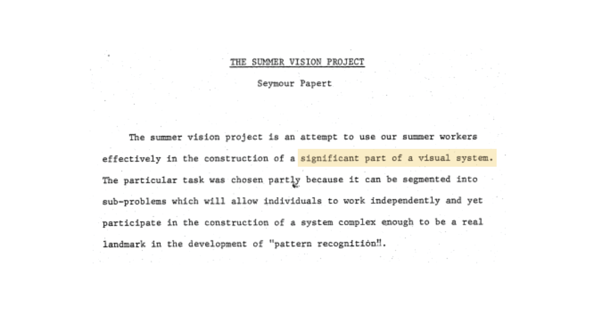
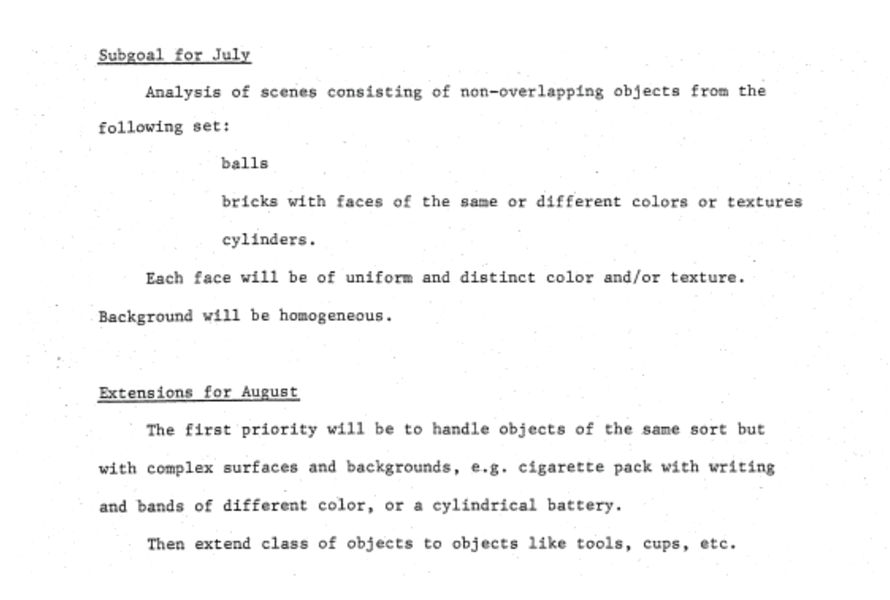

# Deep Learning Workshop

## Agenda
1. Welcome!
2. Setting up your computing environment
3. Storytime - the summer project that took 50 years to finish & what makes computer vision hard
4. Getting image classification results fast with [fastai](https://docs.fast.ai/)
5. Bounding box detection
6. Semantic segmentation
7. Deploying models with [docker](https://github.com/moby/moby) and [flask](https://github.com/pallets/flask)
8. Reflection on studying and working in AI in 2020

## 1. Welcome!

### 1.1 Goal for Our Time Together
**Train and deploy deep learning computer vision models, and have some fun along the way :)**

## 2. Setting up your computing environment
Installing the software you need to train deep learning models can be difficult. For the purposes of this workshop, we're offering 3 recommended methods of setting up your computing environment. Your level of experience and access to machines, should help you determine which appraoch is right for you. 

| | Option | Pros | Cons | Cost | Instructions | 
| - | ------ | ---- | ---- | ---- | ------------ | 
| 1 | Google Colab | Virtually no setup required, start coding right away! | GPUs not always available, limited session times, limited RAM | Free! There's also a paid tier at [$10/month](https://colab.research.google.com/signup) | [Colab Setup](https://github.com/stephencwelch/dsgo-dl-workshop-summer-2020#1-setup-google-colab) |
| 2 | Virtual Machine | Highly configurable & flexible, pay for the performance level you need | Can be difficult to configure, only terminal-based interface | Starts ~$1/hour | [Azure VM Setup](https://github.com/stephencwelch/dsgo-dl-workshop-summer-2020#2-setup-an-azure-virtual-machine) |
| 3 | Your Own Linux GPU Machine | No recurring cost, complete control over hardware. | High up-front cost, takes time to configure. | $1000+ fixed up front cost | [Linux Setup](https://github.com/stephencwelch/dsgo-dl-workshop-summer-2020#3-setup-on-your-own-gpu-machine-running-linux) |

### 2.1 Setup Google Colab

### 2.2 Setup an Azure Virtual Machine

### 2.3 Setup on Your Own GPU Machine Running Linux

## 3. Storytime - the summer project that took 50 years to finish & what makes computer vision hard

**Computer Vision** has a very interesting history. It's roots really go all the way back to the beginning of computing and **Artifical Intelligence.** In these early days, it was unknown just how easy or difficult it would be to recreate the function of the human visual system. A great example of this is the 1966 MIT Summer Vision Project. Marvin Minsky and Seymour Papert, co-directors of the MIT AI Labratory, begun the summer with some ambitious goals:

Minsky and Papert assigned Gerald Sussman, an MIT undergraduate studunt as project lead, and setup specific goals for the group around recognizing specific objects in images, and seperating these objects from their backgrounds. 

Just how hard is it to acheive the goals Minsky and Papert laid out? How has the field of computer vision advance since that summer? Are these tasks trivial now, 50+ years later? Do we understand how the human visual system works? Just how hard *is* computer vision and how far have we come?

## 4. Getting image classification results fast with fastai

## 6. Deploying models with docker and flask

## 7. Reflection on studying and working in AI in 2020
